# Pop-it! felhasználói dokumentáció
A Csodacsapat által fejlesztett Pop-it! implementáció C# nyelven, Windows Forms-ban készült. Pop-It! hub ami a szoftver kiegészítő társa pedig PHP nyelven íródott.

## I. telepítés
A programot nem kell telepíteni, csupán egyetlen fájlból és a hozzá tartozó *palyak* mappából áll. (Megjegyzés: amennyiben nincs *palyak* mappája, úgy a program automatikusan létre fogja hozni.)

## II. Pop-it! GUI használata
### 1. Játék mód
A szoftverben csak helyi játékra van lehetőség. Ez azt jelenti, hogy a két játékos egy gépen tud játszani egymás ellen. (Akárcsak a régi szép időkben.) [Játékostárs hiányában akár a gép ellen is játszhatunk.]
### 1.1. Másik játékos ellen
Ahhoz, hogy egy másik játékossal játszani tudjunk kövessük az alábbi lépéseket:
1. Nyomjunk rá a menüben a *Játék helyi gépen* gombra!

<figure align="center">
    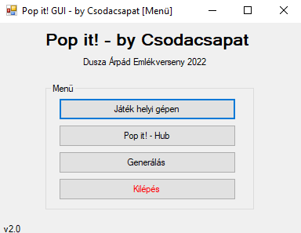
    <figcaption align="center">1. ábra - Menü</figcaption>
</figure>

2. A pályaválasztó menüben válasszunk ki kattinttással egy pályát a listából (amennyiben nincs pályánk a listában úgy *generálhatunk egyet*, vagy *letölthetünk a Pop-it! hub*-ról)!

<figure align="center">
    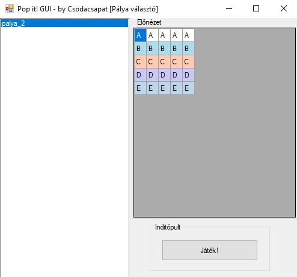
    <figcaption align="center">2. ábra - Pályaválasztó menü</figcaption>
</figure>

3. A pálya kiválasztása után nyomjunk rá a *Játék!* feliratú gombra!

Ezek után a 3. ábrához hasonló ablakot kapunk. Ez az úgynevezett *játéktér*. A játék az alábbi szabályok mentén játszható:
> i. A Pop-it!-ben a gömböcskék vonalakba vannak rendezve.
> 
> ii. Kezdetben minden gömböcske „fel” állapotban van.
> 
> iii. A két játékos felváltva játszik.
> 
> iv. Az első játékos tetszőleges, ugyanazon a vonalon elhelyezkedő egymás melletti gömböcskét nyom le – feltéve, hogy mindegyik gömböcske „fel” állapotban van: Az is lehet, hogy egy adott vonalon egyetlen gömböcskét nyom le, az is lehet, hogy néhány egymás melletti gömböcskét, és az is, hogy a vonalon lévő összes gömböcskét lenyomja.
> 
> v. A második játékos az első játékost ismételve szintén lép, ezután újra az első játékos következik.
> 
> vi. Akkor ér véget a játék, ha valakinek a lépése után már nem marad gömböcske „fel” állapotban. Ekkor az a játékos veszít, aki utoljára lépett.
>
> -- <cite>Forrás: Dusza Árpád Országos Programozói Emlékverseny 21-22 / regionális feladatsor</cite>

<figure align="center">
    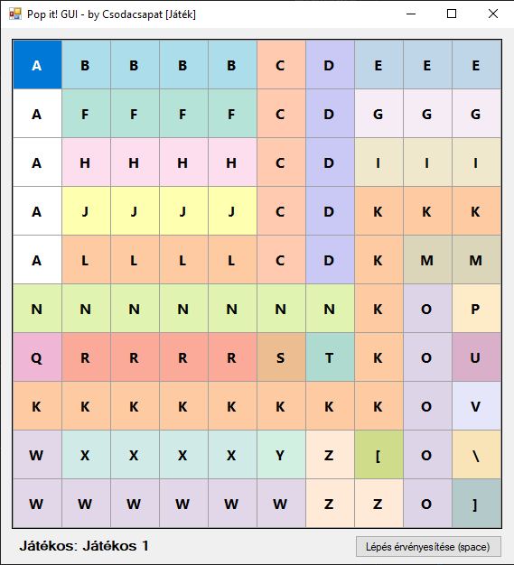
    <figcaption align="center">3. ábra - A játéktér</figcaption>
</figure>

Mindkét játékos ki tud választani több mezőt (akár hajlításokat is!) az egere segítségével. Hasonló kijelölő mozdulatot kell alkalmazni mint a gépünk mindennapi használata közben. Kanyarban a `shift` gomb lenyomásával tudunk egyszerre két "tengelyen" mezőket kijelölni.

Másik lehetőség a `shift` gomb és a nyilak együttes használata. Mindkét módszerrel kényelmes a játék, hisz nem csak egy gomb van a lépés érvényesítésére de a `space` gomb megnyomásával is elérhetjük azt.

Amennyiben a lépés érvényes volt (a fenti szabályoknak megfelelően), akkor az alsó szöveg figyelmeztet arra, hogy már a másik játékos köre van! Ha a lépésünk érvénytelen volt valami miatt, akkor az alábbi hibaüzenet jelenik meg.

<figure align="center">
    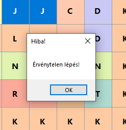
    <figcaption align="center">4. ábra - Érvénytelen lépés üzenet</figcaption>
</figure>

Amennyiben a játéknak vége, úgy az alábbi üzenetek jelennek meg.

<figure align="center">
    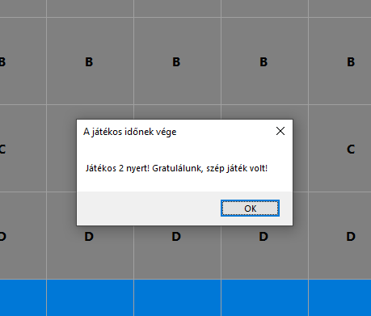
    <figcaption align="center">5. ábra - A nyertest bejelentő üzenet</figcaption>
</figure>

<figure align="center">
    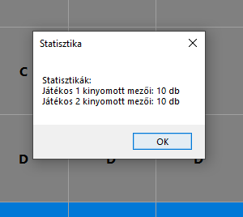
    <figcaption align="center">6. ábra - Statisztika a játékosok teljesítményéről</figcaption>
</figure>

### 1.2. Játék a gép ellen
[Ide még várunk anyagot, lehet hogy töröljük a fejezetet.]

### 2. Pop-it! hub
A Pop-it! hub egy olyan rendszer ami elősegíti, hogy a játékosok a jobbnál-jobb pályáikat megoszthassák mással, így többen ki tudják próbálni azokat. 

A Pop-it! hub-nak két fontos része van. Az egyik maga a kliens, ami képes a pályakat letölteni, valamint a weboldalunk ami ezeket a tartalmakat kiszolgálja, valamint lehetőséget nyújt arra, hogy le is töltsük azokat. Az alábbiakban azt láthatja, hogyan lehet le- illetve feltölteni pályákat.

### 2.1. Letöltés a Pop-it! hub-ról
Ahhoz, hogy a hub-ról le tudjunk tölteni pályákat az 1. ábrán már latható menüben nyomjunk rá a *Pop-it! - Hub* gombra. Ekkor az alábbi ablak jelenik meg.

<figure align="center">
    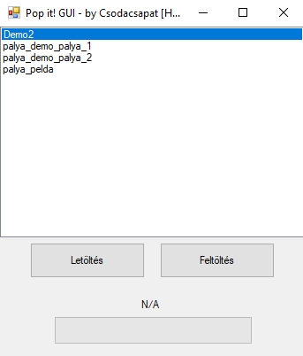
    <figcaption align="center">7. ábra - A Pop-it! hub (kliens oldalon)</figcaption>
</figure>

Az ábrán szereplő lista nem reprezentatív. A pályák nevei mindig annak a függvényében alakulnak, hogy éppen mi van feltöltve az "elosztóra".

A pálya kiválasztása után nyomjunk rá a *Letöltés* gombra. Az alsó progressbar valamint a felette lévő szöveg jelzi, ha a letöltésünk befejeződött. Miután a letöltést befejezte, az 1. fejezetnek megfelelően már lehet is játszani vele.

### 2.2. Feltöltés a Pop-it! hub-ra
Ahhoz, hogy a hub-ra fel tudjunk tölteni pályák, ahhoz a 7. ábrán látható ablakban nyomjunk rá a *Feltöltés* gombra. Ez meg fogja nyitni az operációs rendszerünkben alapértelmezetten beállított böngészőt, benne pedig a Pop-it! hub oldalát.

<figure align="center">
    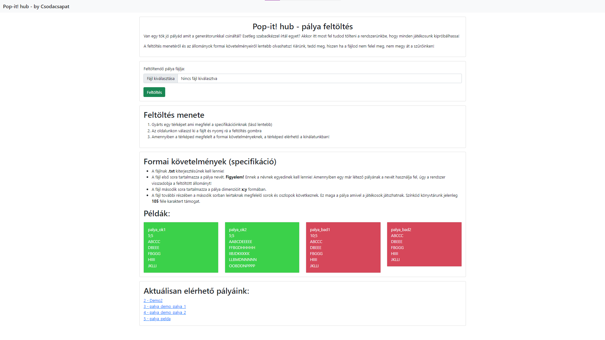
    <figcaption align="center">8. ábra - A Pop-it! hub (weboldal oldalon)</figcaption>
</figure>

Az oldalon láthatunk néhány fontosabb adatot, mint például, hogy milyen pályák vannak már a kínálatunkban, valamint, hogy mik a feltöltendő pályáknak a formai követelményei. (Erről bővebben majd a 2.2.1-es fejezetben olvashat.)

A fájl feltöltő részen válassza ki a pálya állományát, majd kattintson a *feltöltés* gombra! Amennyiben nem ad meg állományt, úgy az oldal erre figyelmezteti.

A feltöltött állomány először egy ellenőrzésen megy át, ami megvizsgálja, hogy minden formai követelményt kielégít-e a pálya. Amennyiben minden rendben van, úgy ilyen üzenet fogad minket:

<figure align="center">
    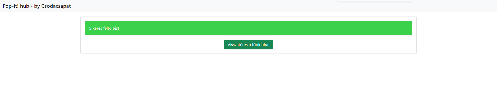
    <figcaption align="center">9. ábra - Sikeres ellenőrzést feltöltést jelző üzenet</figcaption>
</figure>

Amennyiben valamilyen hiba/hibák fordult elő az ellenőrzés során, úgy ehhez hasonlót láthatunk:

<figure align="center">
    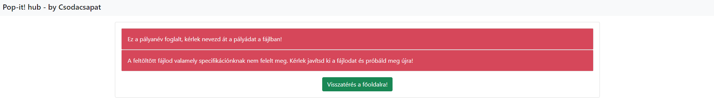
    <figcaption align="center">10. ábra - Sikertelen ellenőrzést feltöltést jelző üzenet</figcaption>
</figure>

A hibaüzenetek a következők lehetnek:
- "A térkép dimenziói nem egyeznek meg!"
- "A térkép sorainak száma nem egyezik meg!"
- "A térkép oszlopainak száma nem egyezik meg!"
- "Ez a pályanév foglalt, kérlek nevezd át a pályádat a fájlban!"
- "A feltöltött fájlod valamely specifikációnknak nem felelt meg. Kérlek javítsd ki a fájlodat és próbáld meg újra!"
- "Elnézést, rendszerhiba történt. Próbáld meg újra!"

### 2.2.1. A pályák formai követelményei
A sikeres pálya feltöltéshez néhány elengedhetetlen követelménynek teljesülnie kell. A követelmények a következők:
- A pálya állományának **.txt** kiterjesztésünek kell lennie!
- A fájl első sora tartalmazza a pálya nevét. **Figyelem!** Ennek a névnek egyedinek kell lennie! Amennyiben egy már létező pályának a nevét használja fel, úgy a rendszer visszadobja a feltöltött állományt!
- A fájl második sora tartalmazza a pálya dimenzióit **x;y** formában.
- A fájl további részében a második sorban leirtaknak megfelelő *sorok* és *oszlopok* következnek. Ez maga a pálya amivel a játékosok játszhatnak. Színkód könyvtárunk jelenleg **105** féle karaktert támogat.

### 3. Pálya generálás
A programban lehetőségünk van pályákat generálni, melyekkel később játszhatunk és/vagy feltölthetjük a Pop-it! hub-ra. Ahhoz, hogy megnyissuk a generátor, a már ismert menüben (1. ábra) nyomjunk rá a *Generálás* gombra! Ekkor az alábbi ablak lesz látható:

<figure align="center">
    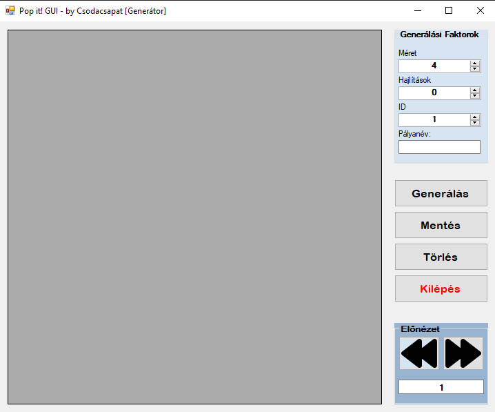
    <figcaption align="center">11. ábra - Pályagenerátor</figcaption>
</figure>

A generálási faktorok a következők:
- Méret: Ez határozza meg, hogy a pálya mekkora legyen (x;y ahol x=y)
- Hajlítások: A szabályokban meghatározott módon generált hajlítások száma. Ez a gyakorlatban azt jelenti, hogy lesznek kanyarok a pályában, máskülönben egymás alá generál sorokat a program.
- ID/Pályanév: Ha a *Pályanév* mező ki van töltve, akkor az *ID* mezőt nem veszi figyelembe a program, vica-versa ha a *Pályanév* mező nincs kitöltve akkor az *ID* mező lesz figyelembevéve mentésnél.
    - Az előbbi esetben az alábbi formában lesz a fájl elnevezve mentéskor: *palya_{palyanev}.txt*
    - Az utóbbi esetben az alábbi formában lesz a fájl elnevezve mentéskor: *palya_{id}.txt*

Példa egy generálásra, beállított teszt paraméterekkel:

<figure align="center">
    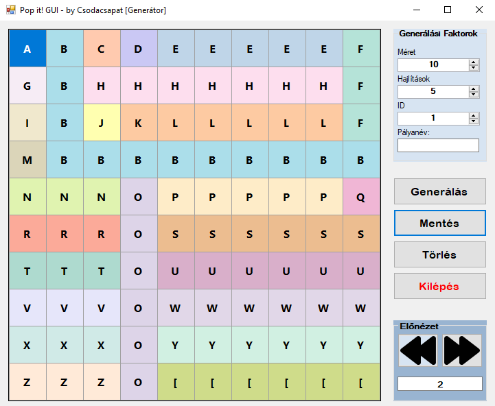
    <figcaption align="center">12. ábra - Generátor teszt</figcaption>
</figure>

A *Generálás* gombbal tudjuk elindítani a generálást (és a legenerált pályák között tudunk utólag is válogatni az *Előnézet* szekció segítségével).

A *Mentés* gombbal el tudjuk menteni a pályát a megadott néven (lásd fentebb).\
**Megjegyzés:** Ha már létezik pálya a megadott id-val vagy pályanévvel, akkor a program figyelmeztetés nélkül felülírja azt!

A *Törlés* gombbal törölni tudjuk az aktuális pályát az előnézeti listából.

A *Kilépés* gombbal ki tudunk lépni a generátorból.

**Figyelem!** Amennyiben üresen próbálunk meg menteni, úgy hibaüzenetet ad a program. 

<figure align="center">
    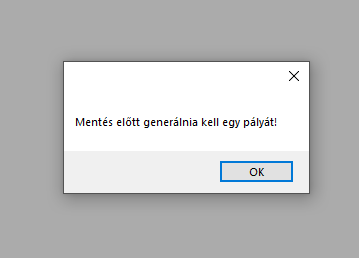
    <figcaption align="center">13. ábra - Hibaüzenet üres mentés esetén</figcaption>
</figure>